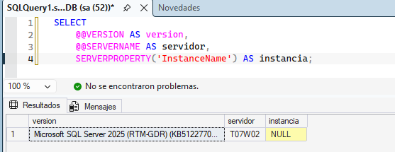
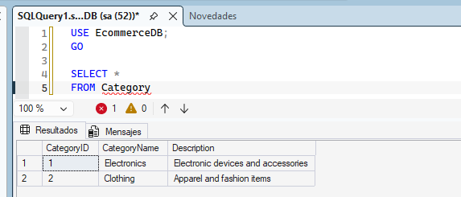

# DP-800-Lab-01
DP-800 Lab 01 - Design and implement database objects with SQL

#Requisitos
  -SQL Server 2025 Enterprise Developer
  -SSMS 22 
Se puede comprobar la version SQL server de la siguiente manera

##Preparación previa 
Clonación de repositorio de github con 
``
git clone  https://github.com/MicrosoftLearning/mslearn-sql-developer.git
``
Posteriormente se copiaron dichos archivos dentro de C:\\LabFiles 
Se crean la bases de datos solicitada: EcommerceDB

Adicional a eso se ejecutan los querys de creación de tablas e inserción de datos de sample que están en el link oficial. 

De manera que hacemos un SELECT en la tabla Category y salen resultados para comprobar que si se cargó

https://microsoftlearning.github.io/mslearn-sql-developer/Instructions/Labs/01-create-database-objects.html

